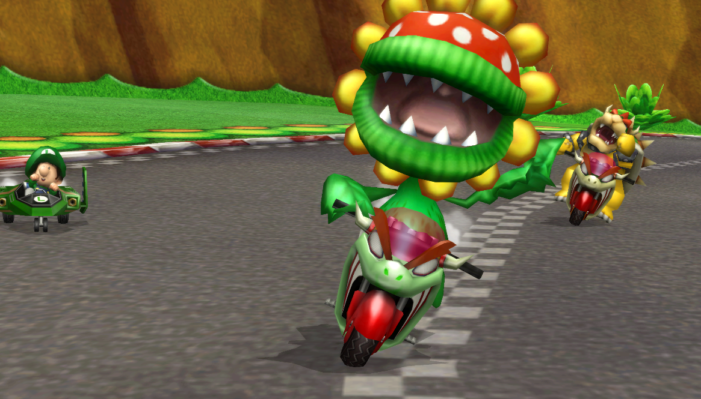

# Mario Kart Mod Generator

Mario Kart Mod Generator allows you to create custom distributions of Mario Kart Wii.
### Why
Currently making a custom Mario Kart requires lots of programs and steps. Many distributions rely on other apps like Gecko OS or Riivolution, while MK Mod Gen allows users to play your Distribution directly from a WBFS or ISO. MK Mod Gen also simplifies the process of making your distribution.
### How
MK Mod Gen uses a python script to patch an ISO by interpreting `project.json` in your `mod` folder. It will automatically patch the ISO using [Python](https://www.python.org/) with Wiimm's [SZS](https://szs.wiimm.de/) and [ISO](https://wit.wiimm.de/) tools.

### Some Legal Stuff
I don't endorse copyright infringement or piracy. This project is licensed under [MIT License](LICENSE). Python is under the [PSF License](https://docs.python.org/3/license.html#psf-license-agreement-for-python-release). Wiimm's SZS and ISO tools are [GNU GPL 2.0+](https://github.com/Wiimm/wiimms-iso-tools).
### Future Plans
- Cup icon swamping
- Player icon showing on leaderboards
- WBFS support
- Region auto detection
- Wiimmfi support
- Custom Music (Maybe)